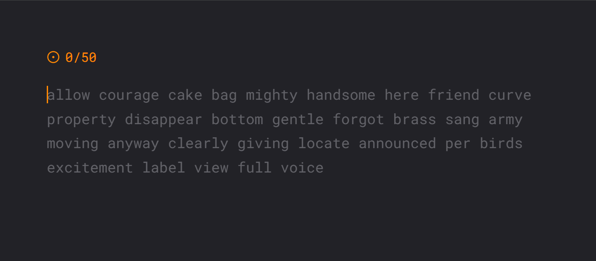

# ⌨️ Typing Master - Advanced Typing Speed Test



## 📝 Description

**Typing Master** is a modern, feature-rich typing speed test application built with Next.js and React. It helps users improve their typing skills by providing real-time feedback, detailed statistics, and an engaging user interface. Whether you're a beginner or an advanced typist, this application offers customizable typing tests to track your progress and enhance your typing speed and accuracy.

---

## ✨ Features

### 🎯 Core Testing Features

- **Two Testing Modes**
  - **Time Mode**: Type as many words as possible within a set time duration (default: 120 seconds)
  - **Words Mode**: Type a specific number of words as fast as possible (default: 50 words)

- **Real-time Typing Feedback**
  - Live character-by-character validation
  - Cursor that follows your typing position
  - Visual indication of correct characters (light gray for typed, dark gray for upcoming)
  - Animated error display showing incorrect characters in red

- **Backspace Support**
  - Fully functional backspace handling
  - Ability to correct mistakes by going back and retyping
  - Automatic tracking of backspace keystrokes

- **Word Management**
  - Automatic word generation using random word lists
  - Dynamic word addition as you approach the end
  - Line-based word locking to prevent jumping between lines
  - Smooth scrolling text display

### 🔊 Sound Effects

- **Correct Keystroke Sound**
  - Plays when you type a correct character
  - Randomized playback rate (0.95x - 1.05x) for natural variation
  - Toggleable via settings

- **Wrong Keystroke Sound**
  - Plays when you type an incorrect character
  - Distinguishable feedback for errors
  - Toggleable via settings

- **Sound Control**
  - Enable/disable sound effects in settings
  - Saves your preference to local storage
  - Non-intrusive notification of typing accuracy

### 📊 Comprehensive Results Dashboard

The typing test generates detailed statistics shown in a modal after completion:

- **WPM (Words Per Minute)** - Your typing speed
- **Time Taken** - Total duration of the test
- **CPM (Characters Per Minute)** - Character typing speed
- **KPM (Keystrokes Per Minute)** - Total keystroke speed
- **Accuracy** - Percentage of correct characters typed
- **Correct Characters** - Total number of correctly typed characters
- **Errors** - Total number of incorrect characters
- **Backspaces** - Number of times backspace was used

### ⚙️ Customizable Settings

Access the settings menu to customize your typing experience:

- **Mode Selection**
  - Switch between "Time" and "Words" modes
  - Instant preview of mode-specific requirements

- **Time Duration** (Time Mode)
  - Choose from preset durations: 15s, 30s, 60s, 120s seconds
  - Test durations match various difficulty levels

- **Word Count** (Words Mode)
  - Choose from preset counts: 10, 25, 50, 100 words
  - Scale your challenge based on skill level

- **Sound Toggle**
  - Enable or disable all sound effects
  - Instant feedback when toggling

- **Persistent Settings**
  - All settings are saved to browser's local storage
  - Your preferences persist across sessions
  - Automatic loading of saved settings on app startup

### 💾 State Management

- **TypingProvider Context**
  - Centralized state management for typing settings
  - Local storage integration for data persistence
  - Easy access to settings throughout the application

### 🎨 UI/UX Features

- **Responsive Design**
  - Fully responsive layout for desktop and mobile devices
  - Optimized for all screen sizes
  - Mobile-friendly touch interactions

- **Dark Theme**
  - Modern dark color scheme for comfortable typing
  - Reduced eye strain during long typing sessions
  - Tailwind CSS for consistent styling

- **Visual Indicators**
  - Animated cursor that blinks when idle
  - Real-time word and character count display
  - Timer display for time-based tests
  - Color-coded statistics (green for correct, red for errors)

- **Interactive Elements**
  - Collapsible settings sidebar
  - Modal-based result display
  - Smooth animations and transitions
  - Icon-based navigation (FaKeyboard, RiTimerLine, etc.)

### 🔄 Test Management

- **Repeat Test**
  - Repeat the same test with the current settings
  - Reset all typing progress and statistics

- **Next Test**
  - Generate a new set of random words
  - Start fresh with a new typing challenge
  - Maintains current settings

- **Auto-focus Input**
  - Click anywhere on the text area to refocus the input
  - Prevents accidental blur during typing

---

## 🛠️ Technical Stack

- **Framework**: Next.js 16.1.1
- **UI Library**: React 19.2.3
- **Language**: TypeScript 5
- **Styling**: Tailwind CSS 4
- **Icons**: React Icons 5.5.0
- **Random Words**: random-words 2.0.1
- **Linting**: ESLint 9
- **Bundling**: Next.js built-in bundler

---

## 📁 Project Structure

```
.
├── public
│   ├── overview.png
│   └── ...
├── src
│   ├── components
│   │   ├── settings
│   │   │   ├── DifficultySettings.tsx
│   │   │   ├── SoundSettings.tsx
│   │   │   └── ThemeSettings.tsx
│   │   ├── typing
│   │   │   ├── TypingArea.tsx
│   │   │   ├── TypingStats.tsx
│   │   │   └── WordDisplay.tsx
│   │   ├── common
│   │   │   ├── Header.tsx
│   │   │   ├── Footer.tsx
│   │   │   └── Modal.tsx
│   │   └── ...
│   ├── contexts
│   │   ├── TypingProvider.tsx
│   │   └── ...
│   ├── hooks
│   │   ├── useTypingStats.ts
│   │   └── ...
│   ├── pages
│   │   ├── _app.tsx
│   │   ├── index.tsx
│   │   └── results.tsx
│   ├── styles
│   │   ├── globals.css
│   │   └── tailwind.css
│   └── utils
│       ├── words.ts
│       └── ...
├── .eslintrc.json
├── .gitignore
├── package.json
└── tsconfig.json
```

---

## 🚀 Getting Started

### Prerequisites

- Node.js (v16 or higher)
- npm or yarn

### Installation

1. Clone the repository:
```bash
git clone <repository-url>
cd TypingTest
```

2. Install dependencies:
```bash
npm install
# or
yarn install
```

3. Run the development server:
```bash
npm run dev
# or
yarn dev
```

4. Open your browser and navigate to `http://localhost:3000`

### Usage

1. **Select Test Mode**
  - Choose between **Time Mode** or **Words Mode** using the buttons on the home page.

2. **Start Test**
  - Click the **Start Test** button to begin.
  - In Time Mode, type as many words as possible before the time runs out.
  - In Words Mode, type the given number of words.

3. **View Results**
  - After completing the test, view your results in the modal.
  - Results include WPM, time taken, accuracy, and more.

4. **Adjust Settings**
  - Open the settings menu to customize your test.
  - Change the mode, time duration, word count, and sound settings.

5. **Repeat or Next Test**
  - Choose to repeat the same test or generate a new one.
  - Your typing progress and statistics will reset.

6. **Focus on Typing**
  - Click on the text area to focus the input.
  - Start typing the displayed words.
  - Use backspace to correct mistakes.

### Statistics Explained

- **WPM (Words Per Minute)**: Measures how many words you typed in a minute.
- **Time Taken**: Total time you spent on the test.
- **CPM (Characters Per Minute)**: How many characters you typed in a minute.
- **KPM (Keystrokes Per Minute)**: Total number of keystrokes (including errors and corrections) per minute.
- **Accuracy**: The percentage of characters typed correctly.
- **Correct Characters**: Total number of characters you typed correctly.
- **Errors**: Total number of incorrect characters.
- **Backspaces**: How many times you used the backspace key to correct mistakes.

---

## 🤝 Contributing

Contributions are welcome! Please follow these steps:

1. Fork the repository
2. Create a new branch (`git checkout -b feature/YourFeature`)
3. Make your changes
4. Commit your changes (`git commit -m 'Add some feature'`)
5. Push to the branch (`git push origin feature/YourFeature`)
6. Open a pull request

---

## 📄 License

This project is licensed under the MIT License - see the [LICENSE](LICENSE) file for details.

---

## Acknowledgements

- Inspired by various typing test applications
- Utilizes random-words package for word generation
- Built with passion and dedication to improve typing skills worldwide
